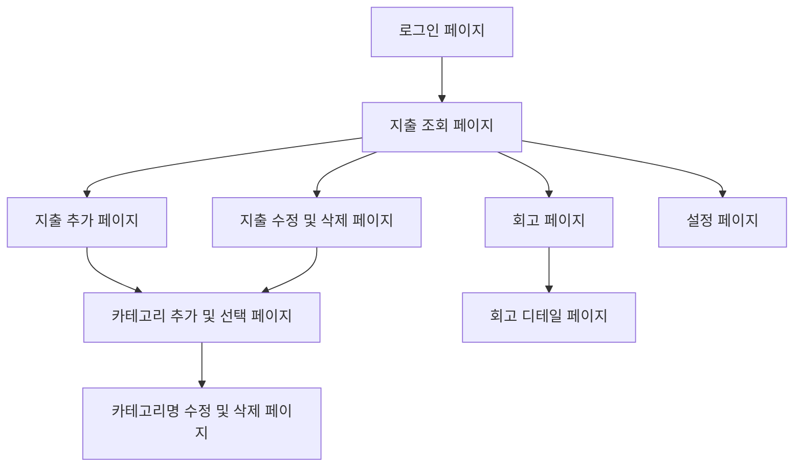
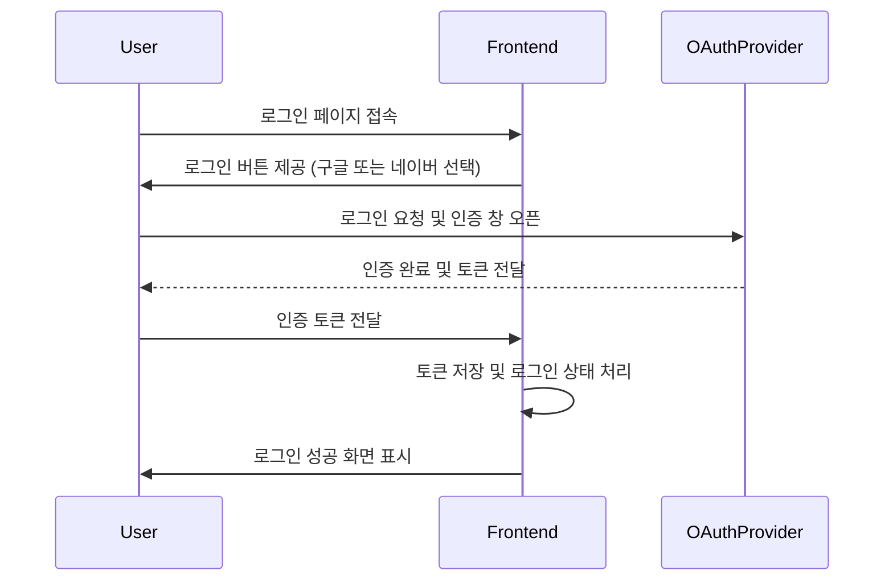
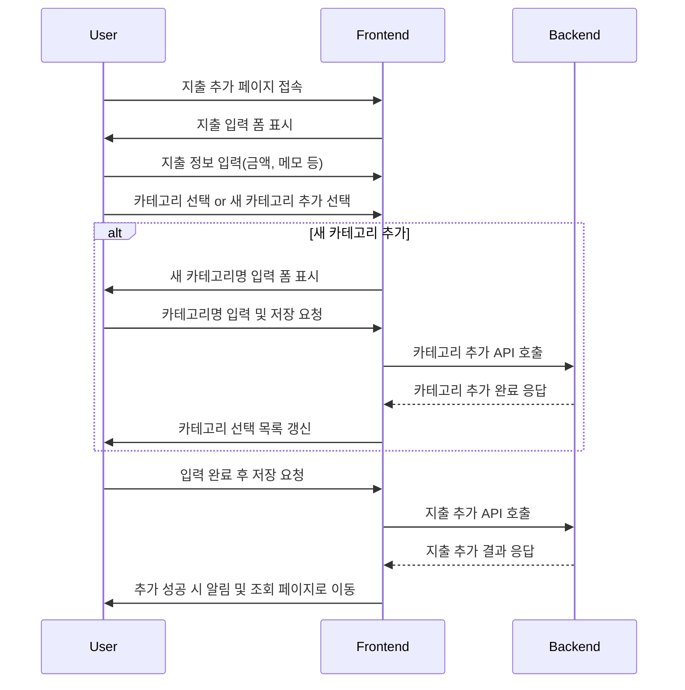
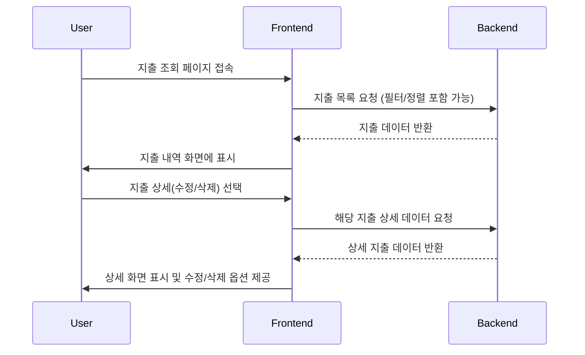
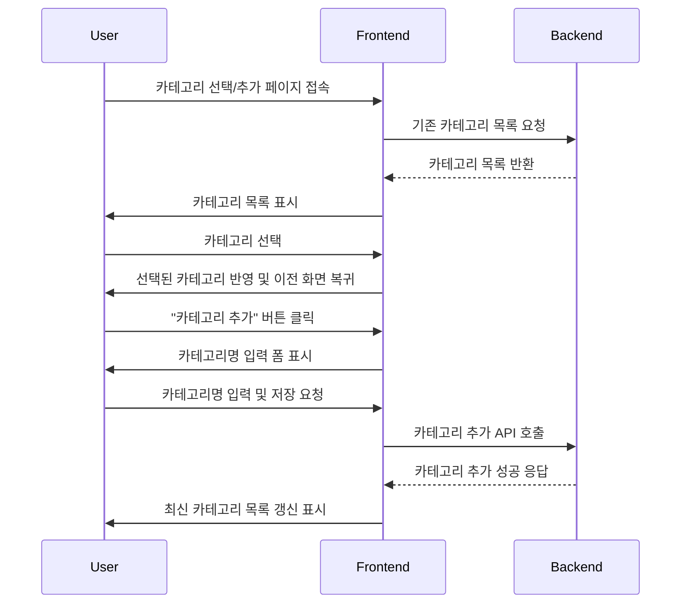

# Blinkit FrontEnd

감정적 소비를 줄이고 의식적 소비를 늘리기 위한 PWA 가계부 애플리케이션입니다.

## 유저 플로우 다이어그램



### 로그인 페이지

OAuthProvider: Google, Naver



### 지출 조회 페이지



#### 지출 추가


### 지출 수정 및 삭제 페이지


### 카테고리 추가 및 선택 페이지



### 카테고리 수정 및 삭제 페이지

### 설정 페이지


## 기술 스택

### 프론트엔드 프레임워크
- **React.js**
- **TypeScript**
- **Vite**

### 상태 관리 및 라우팅
- **TanStack React Query**
- **TanStack React Router**

### UI/UX
- **shadcn/ui**

### 개발 도구 & 테스트

- Unit Test: **Vitest 3.0.7, React Testing Library**
- E2E Test: **Playwright 1.50.1** (향후 추가 예정)

### 코드 품질 관리

- **ESLint & Prettier**

## 폴더 구조

```bash
blinkit-fe/
├── .github/workflows/            # GitHub Actions CI/CD
├── e2e/                          # E2E 테스트 (향후 추가 예정)
├── public/                       # 배포 디렉토리
├── src/                          # fsd 패턴에 따라 분류하고자 함
│   ├── app/                      # 애플리케이션 설정 및 라우터
│   ├── features/                 # 기능별 모듈
│   │   ├── auth/                 # 인증(로그인) 관련
│   │   ├── category/             # 카테고리 관리
│   │   ├── expense/              # 지출 관리
│   │   ├── onboarding/           # 로그인 페이지의 슬라이더 구현
│   │   └── retrospective/        # 회고 기능
│   ├── pages/                    # 페이지 컴포넌트
│   ├── shared/                   # 공통 모듈
│   │   ├── api/                  # API 관련
│   │   ├── lib/                  # 유틸리티 라이브러리
│   │   ├── model/                # 데이터 모델
│   │   ├── types/                # 타입 정의
│   │   └── ui/                   # 공통 UI 컴포넌트
│   │       ├── atoms/            # shadcn/ui 컴포넌트
│   │       └── icons/            # 프로젝트용 아이콘
│   └── widgets/                  # 공용 컴포넌트
├── components.json                # shadcn/ui 설정
├── package.json
├── tailwind.config.js
├── tsconfig.json
├── tsconfig.app.json
├── tsconfig.test.json
├── vite.config.ts
├── vitest.config.ts
└── vitest.setup.ts
```

## 설치 및 실행

```bash
# 저장소 클론
git clone https://github.com/pudding-toy-5/blinkit-fe.git
cd blinkit-fe

# 의존성 설치
pnpm install

# 개발 서버 실행
pnpm dev

# 빌드
pnpm build

# 프리뷰
pnpm preview
```

## 테스트

```bash
# 단위 테스트 실행
pnpm test

# 테스트 UI 모드
pnpm test:ui

# 테스트 감시 모드
pnpm test:watch

# 커버리지 확인
pnpm test:coverage

# E2E 테스트 (Playwright) - 향후 추가 예정
pnpm playwright test
```

## 코드 품질 관리

```bash
# ESLint 검사
pnpm lint
```