# Blinkit FrontEnd

감정적 소비를 줄이고 의식적 소비를 늘리기 위한 PWA 가계부 애플리케이션입니다.


## 프로젝트 개요
- 개발 기간: 2025.02 ~ 현재
- 배포 URL: [https://blink-it.me](https://blink-it.me)
- 실사용 환경 검증: 내부 스터디 멤버 3~5명을 대상으로 실제 테스트 및 피드백 진행, UX 개선 및 기능 보완
- 주요 성과: 사용자 만족도 XX% 향상, PWA 설치율 XX%

## 기술 스택 (주요 버전 포함)

- **프론트엔드:** React.js 19, TypeScript 5.7.2, Vite 6.2.0
- **상태 관리 및 라우팅:** TanStack React Query 5, TanStack React Router 1
- **UI/UX:** shadcn/ui, Tailwind CSS 4.0.9
- **테스트:** Vitest 3.0.7, React Testing Library, Playwright 1.50.1 (향후 예정)
- **코드 품질:** ESLint 9.21.0, Prettier 3.5.3

## 경험

- **아키텍처 적용**: FSD 패턴 참고, 기능별 모듈화 시도, 규칙 일부 미적용 및 리팩토링 경험
- **크로스 브라우저 테스트**: 다양한 환경에서 UI/UX 품질 보장
- **PWA 및 모바일 대응**: iOS Safe Area, 모바일 브라우저 호환성 확보
- **실사용 환경 검증**: Galaxy S23 FE 포함 다수 디바이스 최소 너비 대응
- **사용자 데이터 기반 개선**: Clarity 분석 및 사용자 인터뷰 통한 가설 검증, 기능 개선 반영

## 폴더 구조

```bash
blinkit-fe/
├── .github/workflows/            # GitHub Actions CI/CD 파이프라인 설정 파일
├── e2e/                          # E2E 테스트 코드 디렉토리 (향후 추가 예정)
├── public/                       # 빌드 시 배포되는 정적 파일 디렉토리
├── src/                          # FSD 패턴에 따라 분류한 소스 코드
│   ├── app/                      # 애플리케이션 설정 및 라우터 관리
│   ├── features/                 # 기능별 모듈 (인증, 카테고리, 지출, 회고 등)
│   │   ├── auth/                 # 인증(로그인) 기능
│   │   ├── category/             # 카테고리 관리
│   │   ├── expense/              # 지출 관리 기능
│   │   ├── onboarding/           # 로그인 온보딩 슬라이더 구현
│   │   └── retrospective/        # 회고 기능
│   ├── pages/                    # 페이지 컴포넌트
│   ├── shared/                   # 공통 모듈 (API, 유틸, 타입, UI 등)
│   │   ├── api/                  # API 호출 및 클라이언트 설정
│   │   ├── lib/                  # 유틸리티 함수 및 라이브러리
│   │   ├── model/                # 데이터 모델 정의
│   │   ├── types/                # 전역 타입 정의
│   │   └── ui/                   # 공통 UI 컴포넌트
│   │       ├── atoms/            # shadcn/ui 기반 컴포넌트
│   │       └── icons/            # 커스텀 아이콘 모음
│   └── widgets/                  # 재사용 가능한 복합 UI 컴포넌트
├── components.json
├── package.json
├── tailwind.config.js
├── tsconfig.json
├── tsconfig.app.json
├── tsconfig.test.json
├── vite.config.ts
├── vitest.config.ts
└── vitest.setup.ts
```

## 유저 플로우 다이어그램

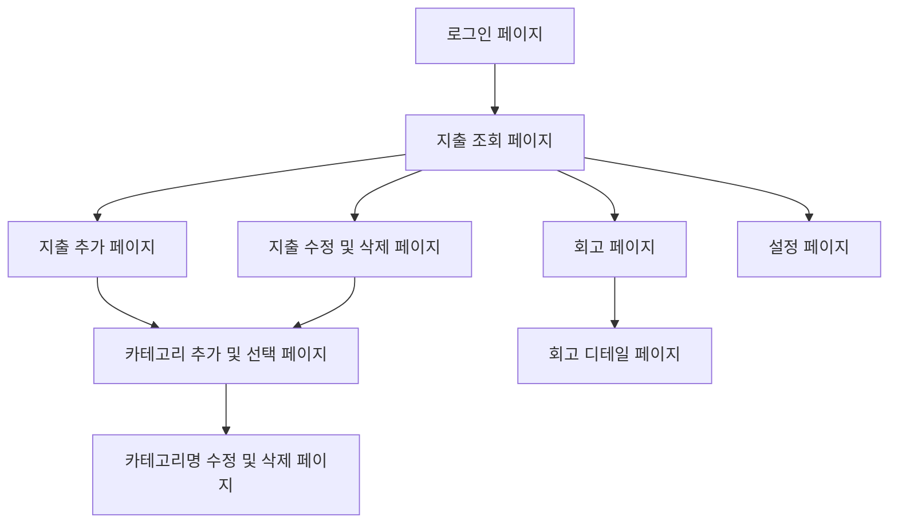

## 페이지 이미지 및 시퀀스 다이어그램

> ⚠️ 썸네일 이미지는 클릭하면 원본 이미지로 이동합니다.

### 로그인 페이지

[](./screenshots/origins/login-page.png)

OAuthProvider: Google, Naver

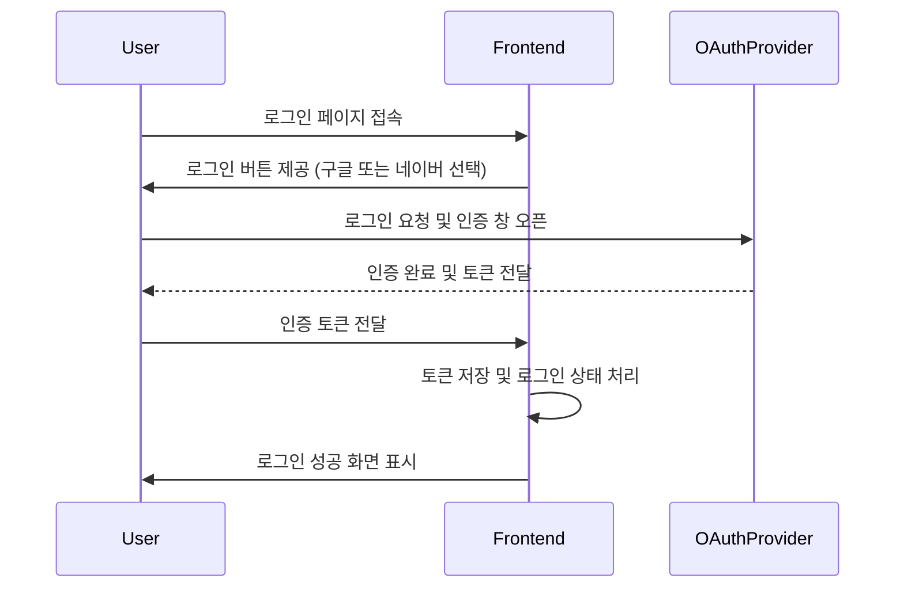

### 지출

#### 지출 조회 페이지

[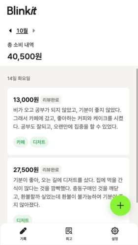](./screenshots/origins/expenses-page.png)

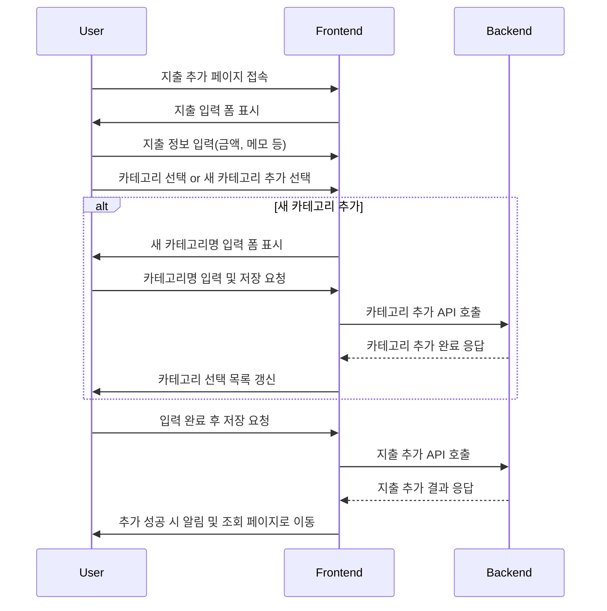

#### 지출 추가 페이지

[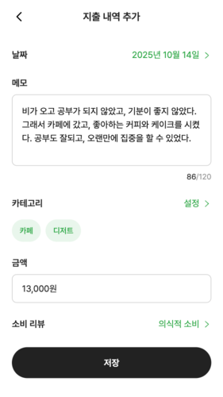](./screenshots/origins/add-expense-page.png)

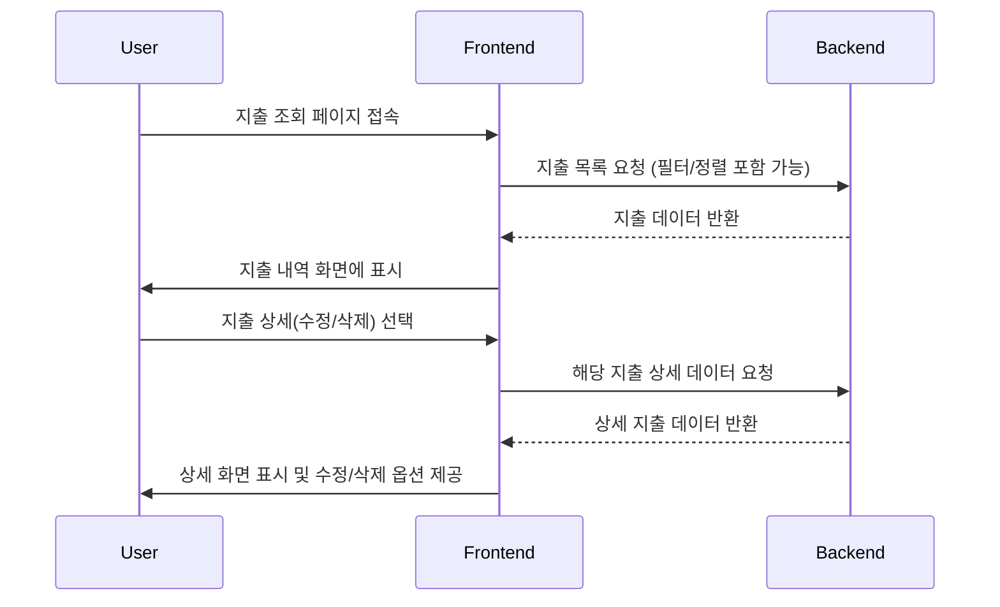

[](./screenshots/origins/add-expense-page.png)

#### 지출 수정 및 삭제 페이지

[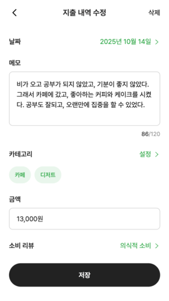](./screenshots/origins/edit-expense-page.png)


### 카테고리

#### 카테고리 추가 및 선택 페이지

[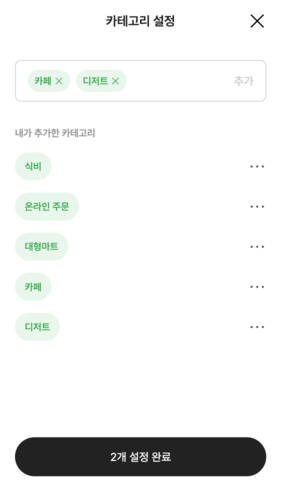](./screenshots/origins/add-select-category-page.png)

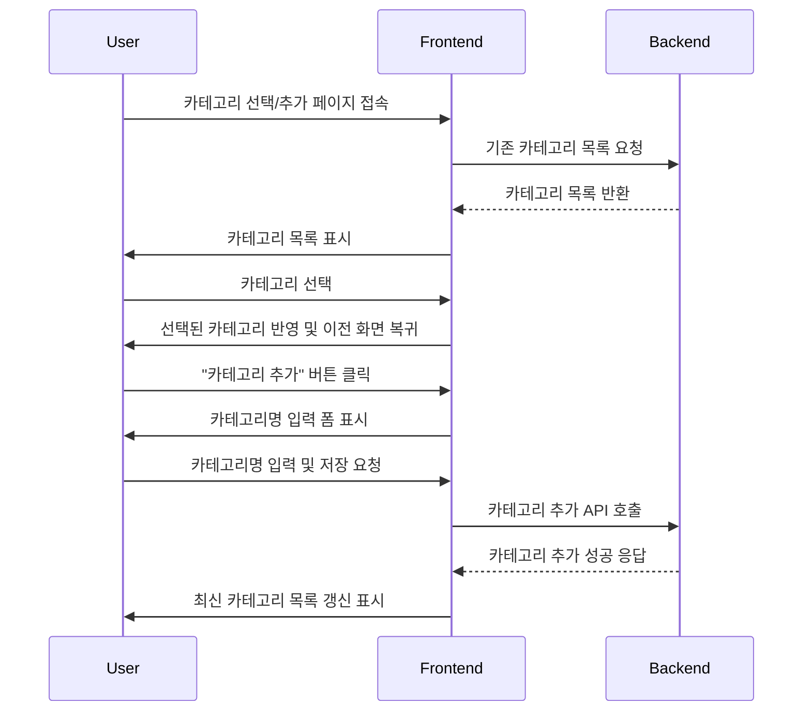


#### 카테고리 수정 및 삭제 페이지

[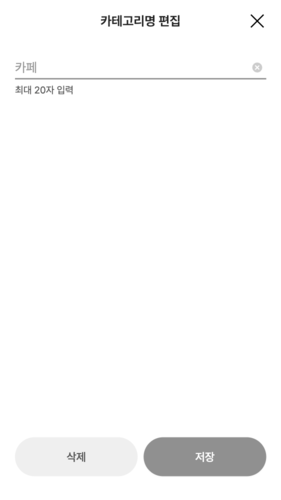](./screenshots/origins/category-detail-page.png)

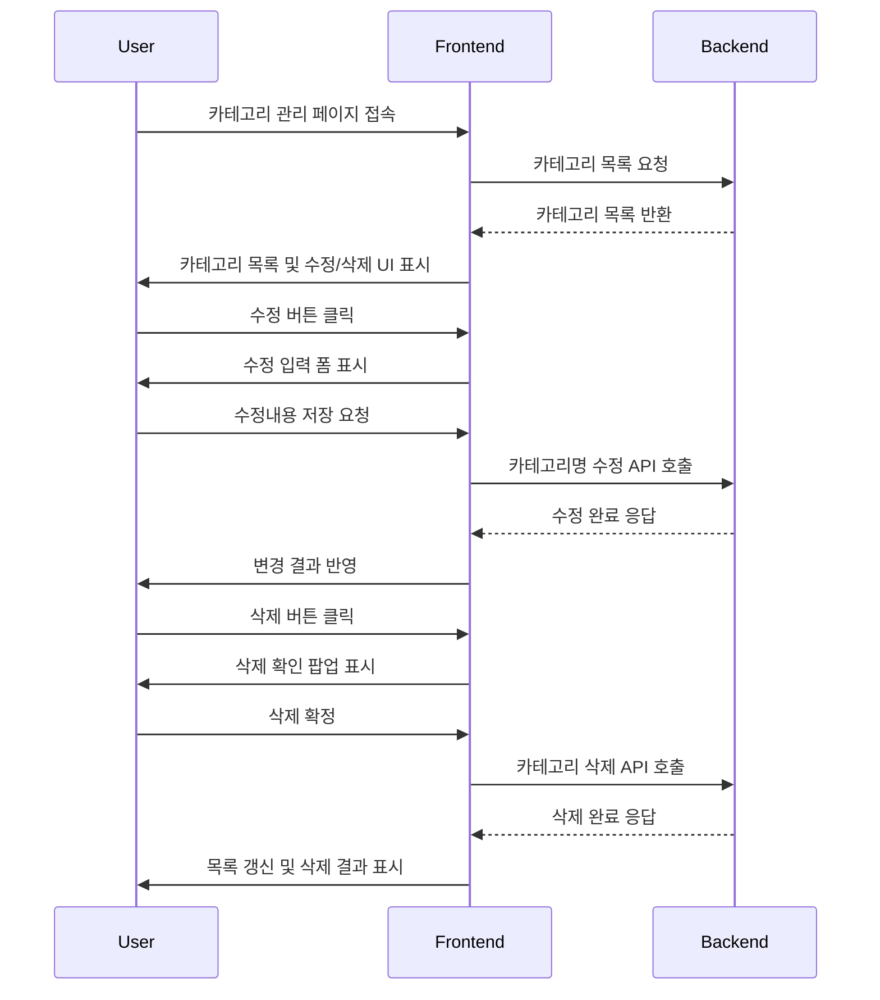

### 설정 페이지

[](./screenshots/origins/settings.png)

#### 닉네임 변경 페이지

[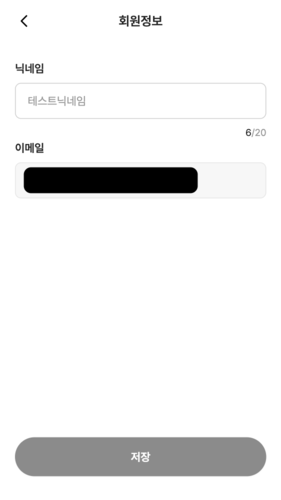](./screenshots/origins/edit-nickname-page.png)

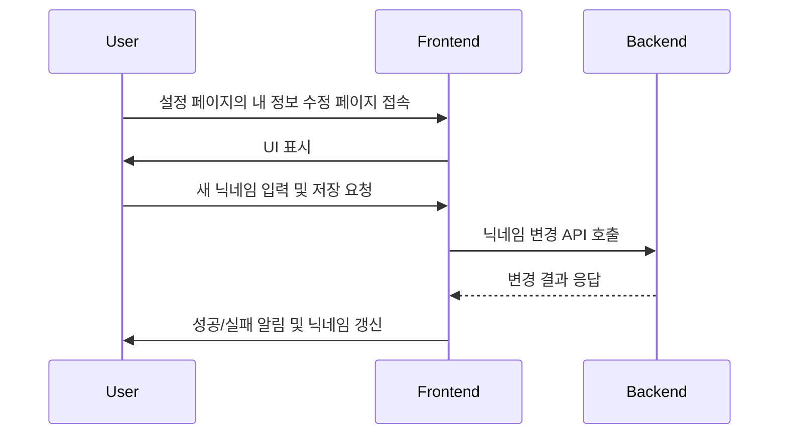
